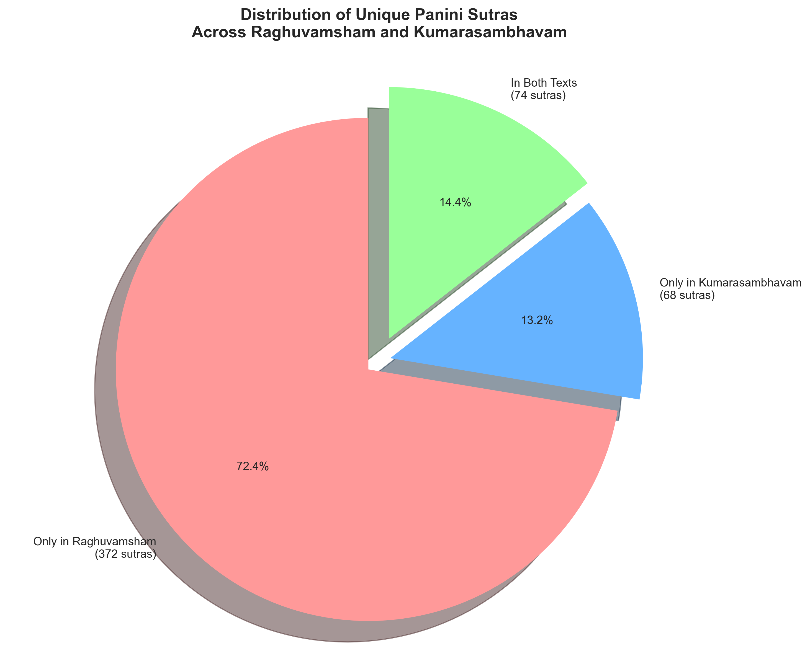

# Panini Sutra Statistics - काव्यप्रयोगाः

Statistical analysis of Panini sutras referenced in Mallinatha's commentaries on Kalidasa's works.

## Overview

This analysis covers Panini sutras extracted from commentaries on:
- **रघुवंशम्** (Raghuvamsham)
- **कुमारसम्भवम्** (Kumarasambhavam)

---

## Total Unique Sutras: 514


---

## Distribution of Sutras

### Pie Chart: Distribution Across Texts



### Breakdown

| Category | Count | Percentage |
|----------|-------|------------|
| **Only in रघुवंशम्** | 372 | 72.37% |
| **Only in कुमारसम्भवम्** | 68 | 13.23% |
| **In BOTH texts** | 74 | 14.40% |

---

## Overlap Analysis


### Key Findings

- **Common sutras**: 74 sutras (14.40% of total)
- **Overlap from रघुवंशम् perspective**: 16.59% of its sutras are shared
- **Overlap from कुमारसम्भवम् perspective**: 52.11% of its sutras are shared

**Insight**: More than half of कुमारसम्भवम्'s sutras are also found in रघुवंशम्, showing significant overlap from the smaller text's perspective.

---

## Coverage by Text


### रघुवंशम् (Raghuvamsham)
- **Unique sutras**: 446
- **Coverage**: 86.77% of all unique sutras
- **Exclusive sutras**: 372 (83.41% of its sutras)
- **Shared sutras**: 74 (16.59% of its sutras)
- **Total references**: 698
- **Average**: 1.57 references per sutra

### कुमारसम्भवम् (Kumarasambhavam)
- **Unique sutras**: 142
- **Coverage**: 27.63% of all unique sutras
- **Exclusive sutras**: 68 (47.89% of its sutras)
- **Shared sutras**: 74 (52.11% of its sutras)
- **Total references**: 172
- **Average**: 1.21 references per sutra

---

## References Comparison


### Total References Across Both Texts: 870

| Text | Unique Sutras | Total References | Avg per Sutra |
|------|--------------|------------------|---------------|
| रघुवंशम् | 446 | 698 | 1.57 |
| कुमारसम्भवम् | 142 | 172 | 1.21 |

**Overall average**: 1.69 references per sutra

---

## Key Insights

1. **रघुवंशम् is the dominant source**
   - Covers nearly 87% of all unique sutras
   - Contains 83% exclusive sutras not found in कुमारसम्भवम्

2. **Moderate overlap between texts**
   - Only 14.4% of sutras appear in both texts
   - This suggests somewhat different grammatical complexity or commentary focus

3. **कुमारसम्भवम् depends more on common sutras**
   - Over half its sutras (52%) are shared with रघुवंशम्
   - This may indicate that कुमारसम्भवम् uses more fundamental/common grammatical rules

4. **रघुवंशम् has higher reference density**
   - Average 1.57 references per sutra vs 1.21 for कुमारसम्भवम्
   - Suggests more detailed or repetitive grammatical explanations

5. **Comprehensive coverage**
   - Together, the two texts reference **514 unique Panini sutras**
   - This represents a significant portion of Panini's grammar, demonstrating the grammatical richness of Kalidasa's poetry

---

## Data Files

- **Extract Files**:
  - `texts/extract/raghuvansham_Extract.json`
  - `texts/extract/kumarasambhavam_Extract.json`

- **Aggregated File**:
  - `textAggregator/KavyaPrayogas.json`

---

## Visualization Script

To regenerate these charts, run:

```bash
python3 AI_Generated/charts/generate_sutra_stats.py
```

---

*Generated automatically from sutra extraction data*
